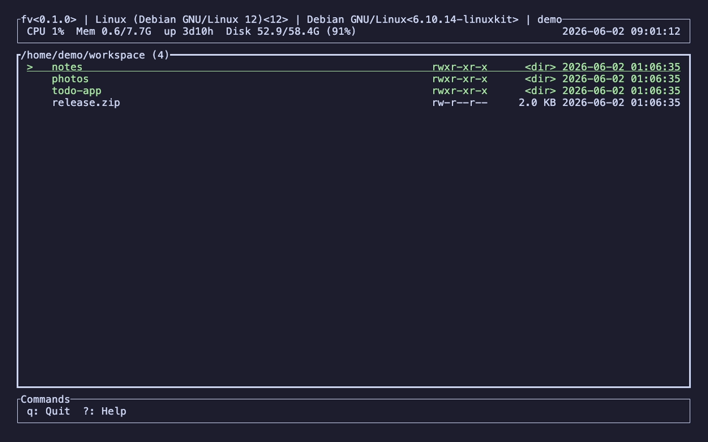

# fv

[](https://github.com/pkshimizu/fv/actions/workflows/ci.yml)
[](https://github.com/pkshimizu/fv/releases)
[](LICENSE)

A fast, keyboard-driven TUI file manager that lives in your terminal.

`fv` is a Rust-based terminal file manager built on a Component Architecture. It keeps file
browsing, file operations, preview, search, and more on a single, clean screen — no GUI required.



**Landing page: <https://pkshimizu.github.io/fv/>** — features, screenshots, and details.

## Features

- **File operations** — copy, move, delete, rename, create files/directories, and zip/unzip.
  Long operations run as cancellable async jobs with progress.
- **Shell & commands** — launch a shell in the current directory or run an arbitrary command.
- **Preview** — text, rendered Markdown, images, and audio (with play/seek) in a side panel.
- **Search & view** — grep through the tree, incremental search, a list filter that hides non-matching files, directory jump, and a directory tree view.
- **File info & attributes** — inspect size, type, permissions, and timestamps.
- **Bookmarks** — save frequently used directories and jump to them quickly.
- **Yank** — copy selected paths to the system clipboard.

## Installation

### Homebrew (macOS Apple Silicon / Linux x86_64)

```sh
brew tap pkshimizu/tap
brew install fv
```

### GitHub Releases

Download the archive for your platform from the
[releases page](https://github.com/pkshimizu/fv/releases), extract it, and place `fv` on your `PATH`.

```sh
# macOS (Apple Silicon)
tar xzf fv-aarch64-apple-darwin.tar.gz
# Linux (x86_64)
tar xzf fv-x86_64-unknown-linux-gnu.tar.gz

mv fv /usr/local/bin/
```

## Key bindings

Press `?` inside fv to open the help panel. The main key bindings in the file list:

### Navigation

| Key | Action |
| --- | --- |
| `Backspace` | Go to parent directory |
| `<` / `>` | Go back / forward in directory history |
| `~` | Go to home directory |
| `j` | Jump to directory |
| `g` | Grep in files |

### Selection & display

| Key | Action |
| --- | --- |
| `Space` | Toggle check mark |
| `Shift`+`A` | Select all / clear selection |
| `.` | Toggle dotfiles visibility |
| `s` | Sort files |
| `f` | Search files |
| `/` | Filter list (hide non-matches) |

### File operations

| Key | Action |
| --- | --- |
| `c` / `m` / `d` | Copy / move / delete files |
| `r` | Rename file |
| `k` / `n` | Create directory / file |
| `l` | Create symlink to the cursor file |
| `p` / `u` | Zip / unzip |
| `x` | Execute command |
| `y` | Yank paths to clipboard |

### Panels & views

| Key | Action |
| --- | --- |
| `a` / `i` | Show file attributes / info |
| `t` / `v` | Show directory tree / preview file |
| `h` | Launch shell |
| `e` | Open in file manager |

### Bookmarks

| Key | Action |
| --- | --- |
| `b` | Show bookmarks |
| `+` / `-` | Add / remove bookmark |

### App

| Key | Action |
| --- | --- |
| `o` | Settings |
| `?` | Show help |
| `q` | Quit |

## Environment variables

| Variable | Description |
| --- | --- |
| `FV_IMAGE_PROTOCOL` | Override the image preview protocol instead of auto-detecting it. Accepts `halfblocks`, `sixel`, `kitty`, or `iterm2` (case-insensitive). Unset or unrecognized values fall back to auto-detection. |

Some terminals (e.g. ttyd / xterm.js-based ones) report graphics protocols they cannot actually render, which leaves the image preview blank. In that case, set `FV_IMAGE_PROTOCOL=halfblocks` to force a protocol that renders everywhere:

```bash
FV_IMAGE_PROTOCOL=halfblocks fv
```

## License

Licensed under the [MIT License](LICENSE).
